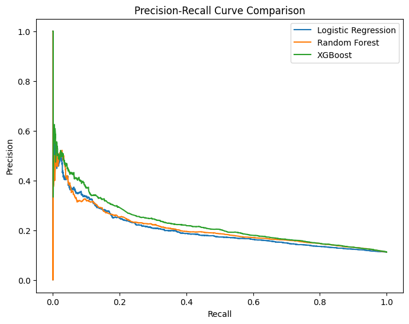
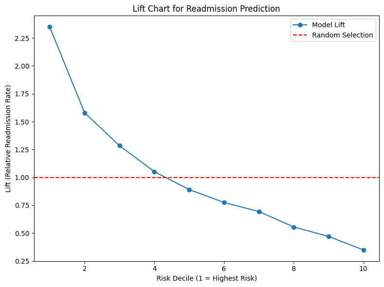

# Predicting 30-Day Hospital Readmissions with Machine Learning


## Live App (may take ~15 seconds to load on first visit)
https://diabetesrisk-xln3ockx8x8zo9mvqbybti.streamlit.app/

The deployed Streamlit app allows users to:

- input patient characteristics
- receive calibrated readmission probability
- classify risk (low / moderate / high)

This simulates a real-world clinical decision support tool.

## Overview
Hospital readmissions are costly and often preventable. This project builds a machine learning model to predict 30-day readmission risk for diabetic patients, enabling hospitals to identify high-risk individuals and intervene early. 

The project integrates:

- predictive modeling (Logistic Regression, Random Forest, XGBoost)
- probability calibration
- interpretability (SHAP)
- business-focused evaluation (lift & gains)
- a deployed interactive Streamlit application

## Business / Clinical Question
Can hospitals identify a manageable subset of high-risk patients for post-discharge intervention programs such as follow-up calls, medication reconciliation, and care coordination?

## Dataset
- Source: Diabetes 130-US hospitals dataset (https://www.kaggle.com/datasets/brandao/diabetes?select=diabetic_data.csv)
- Population: Hospital encounters for diabetic patients across 130 U.S. hospitals
- Size: About 110,000 rows of unique patient data
- Target: Readmitted within 30 days
- Feature types:
  - demographics
  - diagnoses
  - medication and treatment history
  - prior healthcare utilization

# Methods
### Preprocessing
- handled missing values
- one-hot encoded categorical variables
- scaled numeric variables for logistic regression
- preserved the same preprocessing pipeline across train/test data

### Models
- Logistic Regression (L1-regularized baseline)
- Random Forest (nonlinear benchmark)
- **XGBoost (final model)**

```python
from xgboost import XGBClassifier

xgb = XGBClassifier(
    n_estimators=300,
    max_depth=4,
    learning_rate=0.05,
    subsample=0.8,
    colsample_bytree=0.8,
    scale_pos_weight=(y_train == 0).sum() / (y_train == 1).sum(),
    eval_metric="logloss",
    random_state=42,
    n_jobs=-1
)

xgb_pipe = Pipeline(steps=[
    ("preprocess", preprocess),
    ("model", xgb)
])

xgb_pipe.fit(X_train, y_train)
```
### Probability Calibration 
```python
from sklearn.calibration import CalibratedClassifierCV

# Take the fitted xgb_pipe's model definition (not fitted probabilities)
xgb_uncal = xgb_pipe  

calibrated_xgb = CalibratedClassifierCV(
    estimator=xgb_uncal,
    method="isotonic",   
    cv=3                
)

calibrated_xgb.fit(X_train, y_train)
```
Calibration was applied to ensure predicted probabilities are reliable and interpretable for real-world use.

### Evaluation Metrics
Because 30-day readmission is an imbalanced outcome, I focused on:
- ROC-AUC
- PR-AUC
- lift and cumulative gains
- calibration
- threshold-based risk targeting

## Results
| Model | ROC-AUC | PR-AUC |
|------|---------|--------|
| Logistic Regression | ~0.653 | ~0.208 |
| Random Forest | ~0.663 | ~0.207|
| XGBoost | ***~0.676*** | ***~0.228*** |



### Key Performance Metrics
- ROC-AUC (XGBoost): 0.676 (95% CI: 0.665–0.688)
  - The confidence interval indicates that, across repeated samples, the model’s true ROC-AUC would likely fall between 0.665 and 0.688, demonstrating stable and consistent
    performance.
- PR-AUC (XGBoost): ~0.228
  - More informative than ROC-AUC for this imbalanced problem (~11% positives).
- Base readmission rate: 
  - This is the actual proportion of patients readmitted within 30 days in the dataset (i.e., the unconditional probability of readmission).
- Mean predicted probability (calibrated): ~0.111
  - After calibration, the model’s average predicted risk closely matches the true readmission rate (~11.2%), indicating that predicted probabilities are well-calibrated and
    interpretable.
- Top decile lift ≈ 2.3× vs random selection


  
### Key Findings
- XGBoost outperformed both logistic regression and random forest, indicating meaningful nonlinear relationships in patient risk factors.
- Prior inpatient utilization is the strongest predictor of readmission risk.
  - Patients with 0 prior inpatient visits: ~9% risk
  - Patients with 10+ prior visits: >35% risk
- Using a 15% probability threshold flagged about 20% of patients as high risk.
- The top risk decile had about **2.35x** the average readmission rate.
- Targeting the top 20% highest-risk patients captured about **35%** of all readmissions.

## Interpretation
Model interpretation with SHAP and partial dependence plots showed that the most important predictors were:
- number of prior inpatient visits
- number of emergency visits
- time in hospital
- number of medications
- number of diagnoses

These patterns indicate that readmission risk is driven more by prior healthcare utilization and disease burden than by any single diagnosis alone.


## Model/Calculator Application
The model enables hospitals to prioritize a small subset of high-risk patients for targeted interventions such as:

- discharge planning
- follow-up care coordination
- medication management

By focusing on the top risk segments, hospitals can capture a disproportionate share of preventable readmissions while optimizing resource allocation.

## Fairness Check
Average predicted risk was broadly similar across race and gender groups, suggesting no major disparities in average model output.

## Example Risk Profiles
Using the calibrated XGBoost model:
- Low-risk patient: **4.6%** predicted readmission probability
- High-risk patient: **20.8%** predicted readmission probability

This corresponds to approximately **5.5x higher odds** of readmission for the high-risk profile.

## Tools Used
- Python
- Pandas
- scikit-learn
- XGBoost
- SHAP
- matplotlib
- seaborn
- Streamlit

## Next Steps
- add more robust subgroup fairness metrics
- test alternative calibration approaches
- group diagnosis codes into broader clinical categories

## Project Structure
```text
hospital-readmission-ml/
├── README.md
├── notebook/
│   └── readmission_prediction.ipynb
├── images/
├── models/
└── app/
    └── streamlit_app.py
